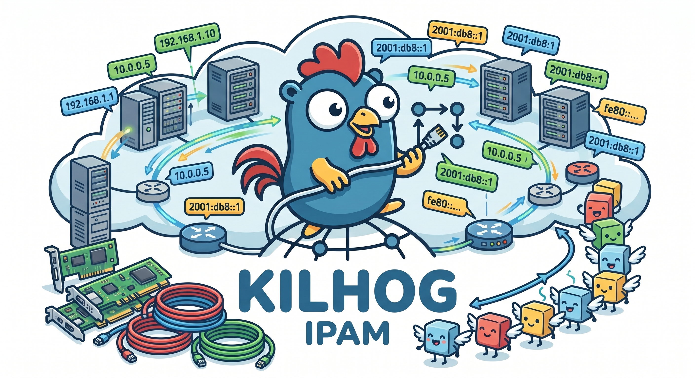

# kilhog

<p align="center">
  
</p>

**kilhog** is an **IPAM** (*IP Address Management*) application: it manages IP pools and addresses through a REST API.

Its name comes from an English–French–Breton word chain: *pool* → *poule* → **kilhog** (*rooster* in Breton) — a rooster that manages the hens, the address pools.

## Features

- **Network** management (tenancy boundaries)
- Hierarchical IPv4 **subnet** management (CIDR blocks and host addresses)
- CIDR validation: parent containment, overlap detection, automatic address allocation
- **SQLite**, **PostgreSQL**, or **Cloudflare D1** persistence with versioned migrations
- JSON REST API with optional API key authentication
- **pogig** CLI and **Go SDK** (`pkg/kilhog`) for programmatic access and Terraform integration
- Cloudflare Workers WASM deployment (`make build-wasm`)
- Ready for multi-tenancy and RBAC

## Documentation

| File | Content |
|------|---------|
| [FUNCTIONAL.md](FUNCTIONAL.md) | Business rules: entities, uniqueness constraints, subnet hierarchy |
| [TECHNICAL.md](TECHNICAL.md) | Architecture, stack, database schema, API routes and examples |

## Quick start

```bash
# Build and run the server (SQLite, port 8080)
make run-dev

# Build the CLI (pogig — Breton for "chick")
make build-pogig

# In another terminal: check health and create sample data
./bin/pogig health
make dev-create-networks
make dev-create-subnets
KILHOG_API_KEY=dev-secret ./bin/pogig network list
```

`make run-dev` enables API key auth with the default key `dev-secret`. Dev script targets pass the same key automatically. Disable auth with `make run-dev KILHOG_API_KEY=`.

Check that the API responds:

```bash
curl http://localhost:8080/healthz
curl -H "Authorization: Bearer dev-secret" http://localhost:8080/networks
```

`GET /healthz` stays public so load balancers and orchestrators can probe without credentials. Override the dev key on any Make target:

```bash
make run-dev KILHOG_API_KEY=my-secret
```

## Build

```bash
make build        # API server binary in bin/kilhog
make build-pogig  # CLI binary in bin/pogig
make build-all    # both native binaries
make build-wasm   # Cloudflare Workers WASM (workers/build/)
make docker-build # scratch image (kilhog:local)
make test         # run tests
make ci           # vet + test + build (same checks as GitHub Actions CI)
```

The Docker image is a multi-stage build ending on `scratch` (static binary only). See [TECHNICAL.md](TECHNICAL.md) for run examples and env defaults.

## CI/CD

GitHub Actions workflows:

- **CI** (`.github/workflows/ci.yml`) — on push/PR to `main`: vet, test, build, Docker image, and cross-compile smoke checks
- **Release** (`.github/workflows/release.yml`) — on `v*` tags: build multi-platform archives and publish a GitHub Release

See [TECHNICAL.md](TECHNICAL.md) for details.

## Cloudflare Workers

```bash
# One-time: create D1 DB and set database_id in workers/wrangler.jsonc
cd workers && npx wrangler d1 create kilhog

make worker-dev      # local preview (Wrangler)
make worker-deploy   # deploy to Cloudflare
```

See [TECHNICAL.md](TECHNICAL.md) for Worker env vars, D1 binding, and size limits.

## CLI and SDK

| Component | Path | Role |
|-----------|------|------|
| **pogig** CLI | `cmd/pogig` | Command-line client for the REST API |
| **Go SDK** | `pkg/kilhog` | Shared HTTP client for pogig and external consumers (e.g. Terraform provider) |

Configure both with `KILHOG_BASE_URL` and `KILHOG_API_KEY` (or `--base-url` / `--api-key` flags on pogig).

The Terraform provider is maintained in a **separate Git repository** and should import `github.com/kilhog-io/kilhog/pkg/kilhog`. See [TECHNICAL.md](TECHNICAL.md) for SDK methods and pogig commands.

## Stack

- Go 1.26+
- REST API, layered architecture (`handler` → `service` → `repository`)
- SQLite, PostgreSQL, and Cloudflare D1 (Workers WASM) drivers

See [TECHNICAL.md](TECHNICAL.md) for configuration details, routes, and the relational schema.
